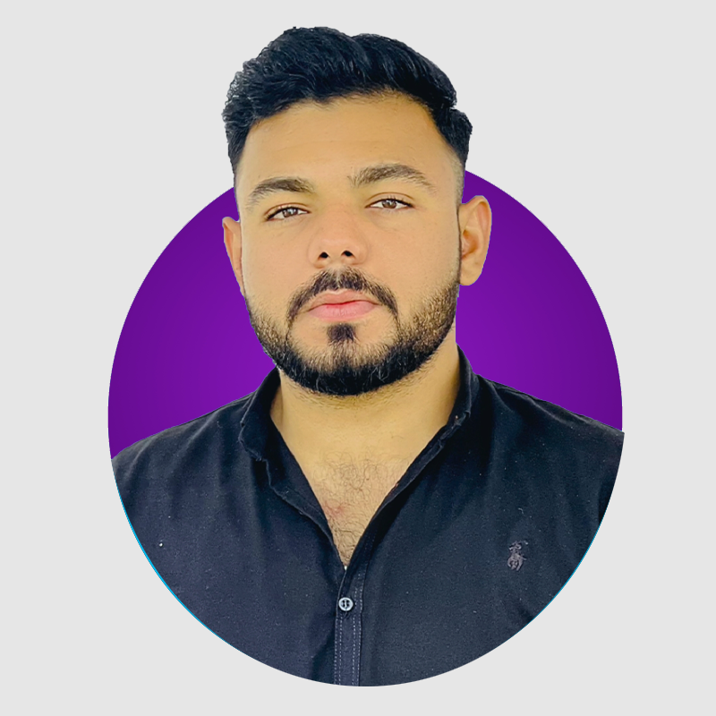
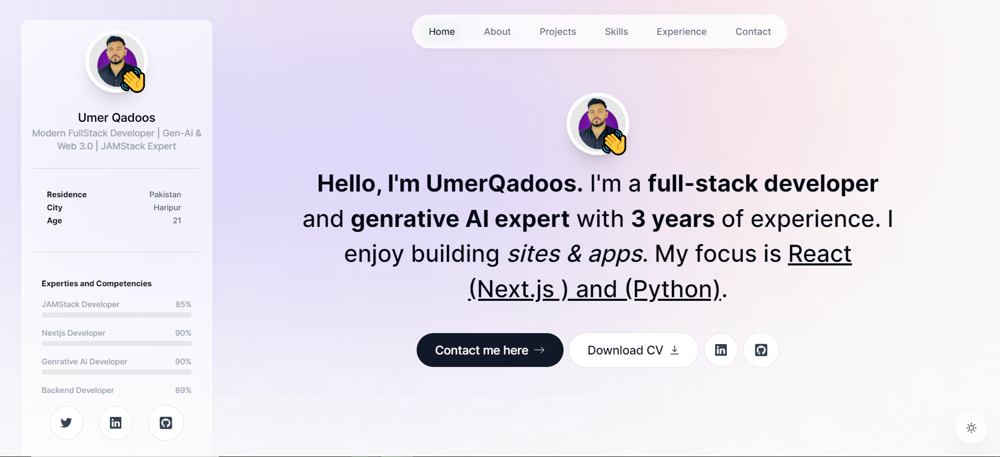

Umer Qadoos - Personal Portfolio Website

https://img.shields.io/github/repo-size/MrUmerQadoos/portfolio
https://img.shields.io/github/stars/MrUmerQadoos/portfolio?style=social
https://img.shields.io/github/forks/MrUmerQadoos/portfolio?style=social

 
 

<h2 align="center">Umer Qadoos - Personal portfolio</h2>

This website is a fully responsive personal portfolio,  Responsive for all devices, built using Next.js, TailwindCSS only.

<a href="https://umerqadoos-portfolio-website.vercel.app/"><strong>➥ Live Demo</strong></a>

 

Features
•  A landing page that introduces myself and my expertise, with a catchy headline and a call to action button.

•  A portfolio page that displays my projects, with a brief description, a screenshot, and a link to the GitHub repository or the live demo.

•  A resume page that summarizes my education, work experience, certifications, awards, and skills, with a download option for a PDF version.

•  A contact page that allows visitors to send me a message, with a form that validates the input and a success message that confirms the submission.

•  A blog page that showcases my writing skills and my thoughts on various topics related to web development, generative AI, and web 3.0.

•  A gallery page that shows some of my graphic artworks that I created using generative AI, with a caption and a link to the source code or the tool that I used.

Demo Screenshots

Prerequisites
Before you begin, ensure you have met the following requirements:

•  [Git](https://git-scm.com/downloads "Download Git") must be installed on your operating system.

Run Locally
To run portfolio locally, run this command on your git bash:

Linux and macOS:

sudo git clone https://github.com/MrUmerQadoos/personal-portfolio-website

Windows:

git clone https://github.com/MrUmerQadoos/personal-portfolio-website

Contact
If you want to contact me, you can reach me at <a href="mailto:umerqadoos74@gmail.com">umerqadoos74@gmail.com</a>.

Hire Me
If you are looking for a website developer who can create fast, secure, and innovative websites for your business, you have come to the right place. I have experience in building Shopify themes and websites using various technologies such as React.js, Next.js, TypeScript, Tailwind CSS, and GraphQL. I also have knowledge of generative AI with Python and Langchain, and how to implement it with websites to help businesses grow and innovate. I am passionate about creating engaging and responsive web solutions that meet the needs and expectations of the clients. If you are interested in hiring me, please contact me through the form on the website or send me an email at <a href="mailto:umerqadoos74@gmail.com">umerqadoos74@gmail.com</a>. I look forward to working with you and creating amazing websites for your business.